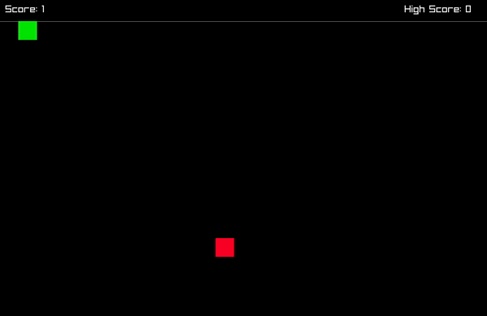

# Snake
Implementation of the classic game in C

## About The Project
I decided to create snake in order to apply what I learned in my Introduction to Computer Systems class where I learned C. This project helped me grasp a better understanding of low-level programming, especially memory allocation.

## Getting Started
### Prerequisites
There are no prerequisites or dependencies to this project. The Raylib source code is already included as part of the project

### Installation
Clone the repository into your project directory
```
git clone https://github.com/THuitema/snake.git
```

### Running
1. Build the executable with the Makefile
```
make
```
2. If your are on a UNIX operation system (e.g. Linux and OSX), run the game with 
```
./snake
```
If you are on Window, run the game with
```
snake
```

